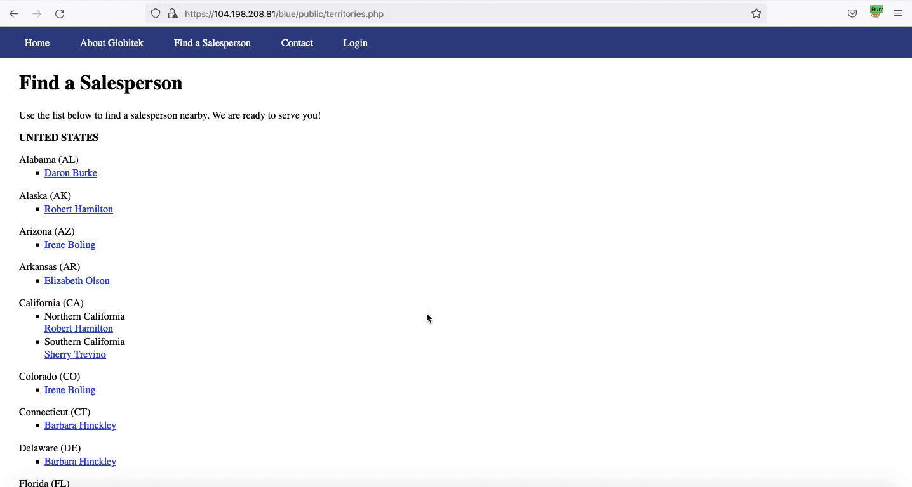
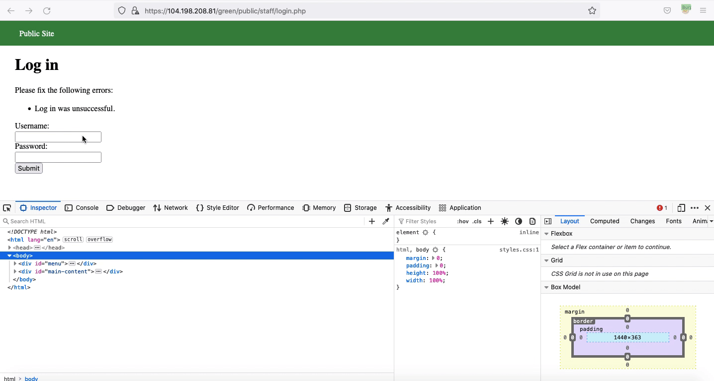
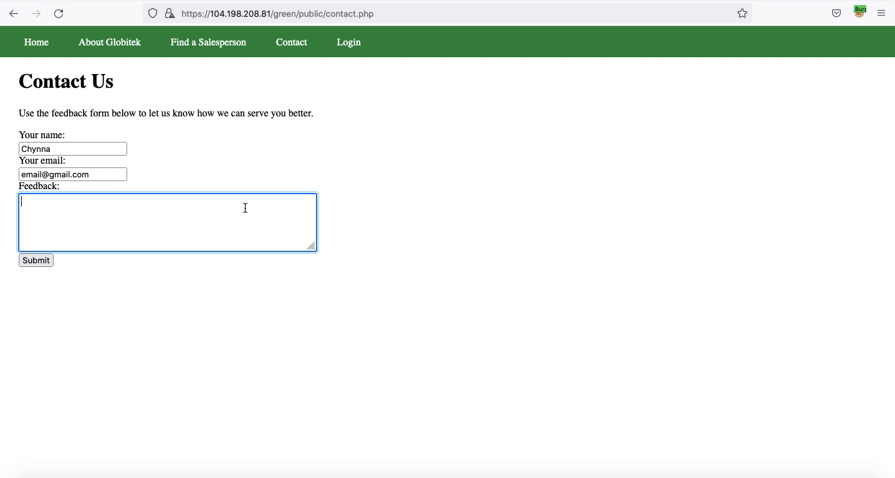
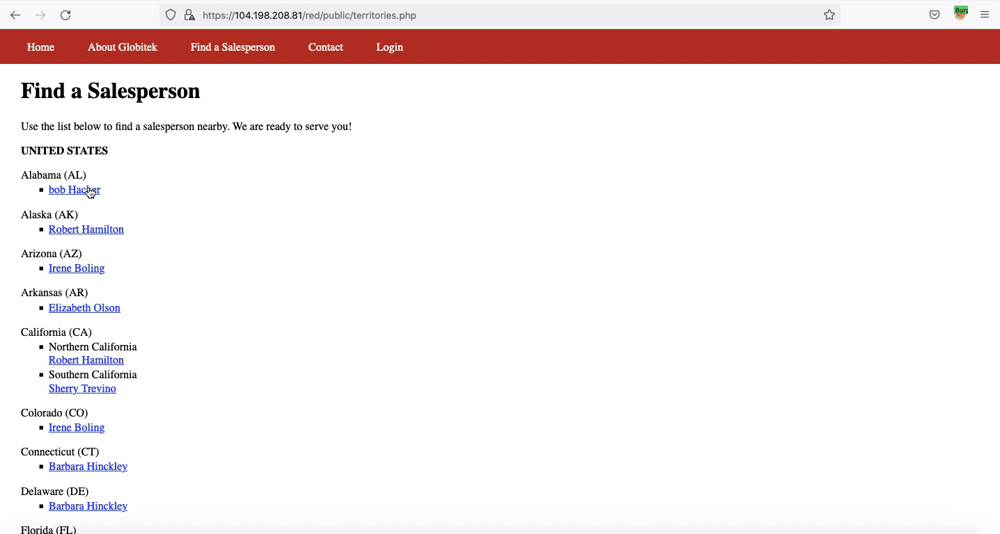

# Project 9 - Pentesting Live Targets

Time spent: **X** hours spent in total

> Objective: Identify vulnerabilities in three different versions of the Globitek website: blue, green, and red.

The six possible exploits are:

* Username Enumeration
* Insecure Direct Object Reference (IDOR)
* SQL Injection (SQLi)
* Cross-Site Scripting (XSS)
* Cross-Site Request Forgery (CSRF)
* Session Hijacking/Fixation

Each color is vulnerable to only 2 of the 6 possible exploits. First discover which color has the specific vulnerability, then write a short description of how to exploit it, and finally demonstrate it using screenshots compiled into a GIF.

## Blue

Vulnerability #1: Session Hijacking/Fixation

Description:

Vulnerability #2: __________________

Description:

## Green

Vulnerability #1: Username Enumeration

Description: The error message that is shown upon entering an incorrect password is located in a span element with a class name that differs based on whether or not the entered username is incorrect. The class name is "failed" for an incorrect username and "failure" for a correct one. This discrepancy could make it easier for for hackers to know when an attempt at username enumaeration is successful.

Vulnerability #2: Cross-Site Scripting

Description: A user who is providing feedback through the Contact Us form can submit code to be used in a stored XSS attack. The attack is executed when an administrator views the user feedback page.

## Red

Vulnerability #1: Insecure Direct Object Reference

Description: This vulnerability allows users to use URL manipulation to view salesperson pages that they should not be able to access. The other two sites don't have this vulnerabilty because attempting the same method of URL manipulation results in the user being redirected to the main Find a Salesperson page.

Vulnerability #2: __________________

Description:

## Notes

Describe any challenges encountered while doing the work
