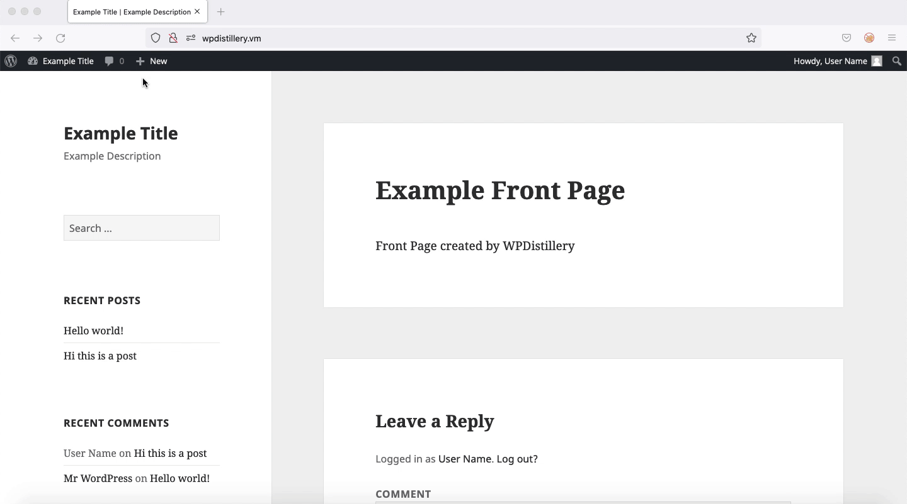

# Project 7 - WordPress Pentesting

> Objective: Find, analyze, recreate, and document **three vulnerabilities** affecting an old version of WordPress

## Pentesting Report

### 1. WordPress <= 4.2 - Unauthenticated Stored Cross-Site Scripting (XSS)
  - [ ] Summary: 
    - Vulnerability types: Cross-Site Scripting (Stored)
    - Tested in version: 4.2
    - Fixed in version: 4.2.1
  - [ ] GIF Walkthrough: 
  - [ ] Steps to recreate:
    - Log in as a user who has been approved to comment
    - Enter a comment with a length of over 64 kb that contains JavaScript code to be executed
  - [ ] Affected source code:
    - [Link 1](https://core.trac.wordpress.org/changeset/32299)
### 2. WordPress  3.7-4.4 - Authenticated Cross-Site Scripting (XSS)
  - [ ] Summary: 
    - Vulnerability types: Cross-Site Scripting
    - Tested in version: 4.2
    - Fixed in version: 4.4.1
  - [ ] GIF Walkthrough: 
  - [ ] Steps to recreate:
    - Log in as an administrator
    - Enter a comment containing code to be injected via a stylesheet or template name
  - [ ] Affected source code:
    - [Link 1](https://core.trac.wordpress.org/changeset/36185)
### 3. WordPress <= 4.2.2 - Authenticated Stored Cross-Site Scripting (XSS)
  - [ ] Summary: 
    - Vulnerability types: Cross-Site Scripting (Stored)
    - Tested in version: 4.2
    - Fixed in version: 4.2.3
  - [ ] GIF Walkthrough: 
  - [ ] Steps to recreate:
    - Log in as a user who has permission to make posts
    - Using the Text (not Visual) post editing mode, compose a post including HTML code that contains JavaScript code to be executed within the post
  - [ ] Affected source code:
    - [Link 1](https://core.trac.wordpress.org/changeset/33359)

## Assets

No additional assets were used.

## Resources

- [WordPress Source Browser](https://core.trac.wordpress.org/browser/)
- [WordPress Developer Reference](https://developer.wordpress.org/reference/)

GIFs created with [Kap](https://getkap.co/).

## Notes

It was sometimes challenging to determine what circumstances and permissions needed to be in place for a vulnerability to be exploitable.

## License

    Copyright [2021] [Chynna Starr]

    Licensed under the Apache License, Version 2.0 (the "License");
    you may not use this file except in compliance with the License.
    You may obtain a copy of the License at

        http://www.apache.org/licenses/LICENSE-2.0

    Unless required by applicable law or agreed to in writing, software
    distributed under the License is distributed on an "AS IS" BASIS,
    WITHOUT WARRANTIES OR CONDITIONS OF ANY KIND, either express or implied.
    See the License for the specific language governing permissions and
    limitations under the License.
